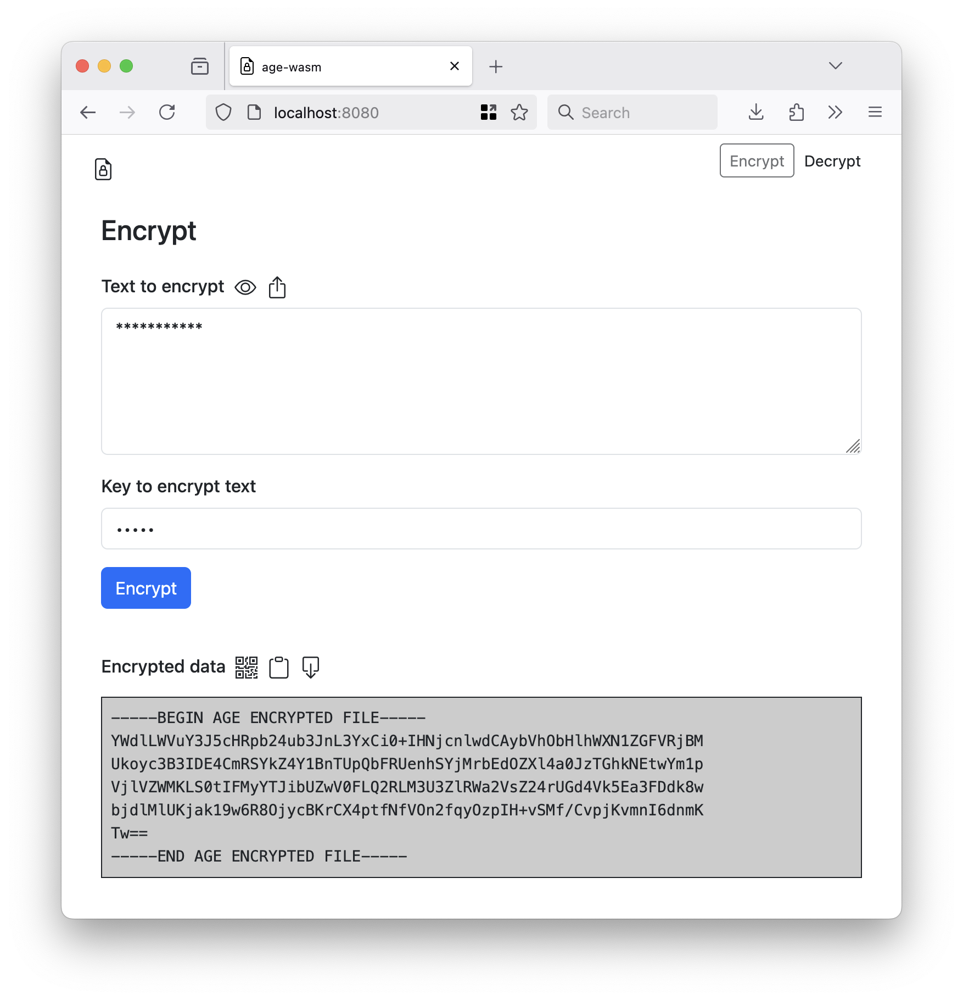

# wasm-age

Experimental package to export the `filippo.io/age` scrypt encrypt and decrypt functions as a WebAssembly (WASM) binary.

## Experimental

Did I mention that was experimental? As in it _seems_ to work but I haven't finished thinking about it. There may be bugs. It may be a terrible idea.

## Building

There is a pre-built `age.wasm` binary in the [www/wasm](www/wasm) folder but if you need or want to rebuilt it the easiest thing is to use the handy `wasmjs` Makefile target:

```
$> make wasmjs
GOOS=js GOARCH=wasm \
		go build -mod vendor -ldflags="-s -w" -tags wasmjs \
		-o www/wasm/age.wasm \
		cmd/wasm/main.go
```		

## Example

Point a web server at the [www](www) folder and then load it in your web browser.





## See also

* https://github.com/FiloSottile/age
* https://github.com/sfomuseum/js-sfomuseum-golang-wasm
* https://github.com/davidshimjs/qrcodejs
* https://github.com/cozmo/jsQR