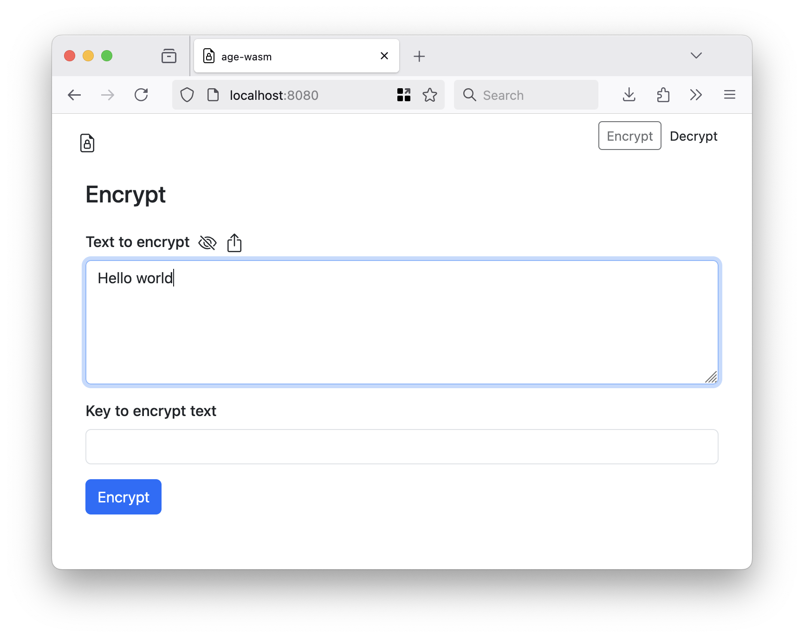

# wasm-age

Experimental package to export the `filippo.io/age` scrypt encrypt and decrypt functions as a WebAssembly (WASM) binary.

## Experimental

Did I mention that was experimental? As in it _seems_ to work but I haven't finished thinking about it. There may be bugs. It may be a terrible idea.

## Building

There is a pre-built `age.wasm` binary in the [www/wasm](www/wasm) folder but if you need or want to rebuilt it the easiest thing is to use the handy `wasmjs` Makefile target:

```
$> make wasmjs
GOOS=js GOARCH=wasm \
		go build -mod vendor -ldflags="-s -w" -tags wasmjs \
		-o www/wasm/age.wasm \
		cmd/wasm/main.go
```		

## Example

Point a web server at the [www](www) folder and then load it in your web browser. I like to use the `fileserver` tool in the [aaronland/go-http-fileserver]() package mostly because I wrote but, really, any web server will do. For example:

```
$> fileserver -root www
2025/06/04 10:36:23 Serving www and listening for requests on http://localhost:8080
```

And then when you open your web browser to `http://localhost:8080` you see something like this:


The default tab allows you to encrypt arbitrary text data. By default the text entered in to the form is hidden:


If you click on the <svg xmlns="http://www.w3.org/2000/svg" width="16" height="16" fill="currentColor" class="bi bi-eye" viewBox="0 0 16 16">
  <path d="M16 8s-3-5.5-8-5.5S0 8 0 8s3 5.5 8 5.5S16 8 16 8M1.173 8a13 13 0 0 1 1.66-2.043C4.12 4.668 5.88 3.5 8 3.5s3.879 1.168 5.168 2.457A13 13 0 0 1 14.828 8q-.086.13-.195.288c-.335.48-.83 1.12-1.465 1.755C11.879 11.332 10.119 12.5 8 12.5s-3.879-1.168-5.168-2.457A13 13 0 0 1 1.172 8z"/>
  <path d="M8 5.5a2.5 2.5 0 1 0 0 5 2.5 2.5 0 0 0 0-5M4.5 8a3.5 3.5 0 1 1 7 0 3.5 3.5 0 0 1-7 0"/>
</svg> icon you can see the text you've entered:



_Click the [NO-EYEBALL] icon to hide the text again._

Add a password (key) to encrypt the content.


When you click the `Encrypt` button your text will be encrypted using `age` WebAssembly binary and the result will be printed to the screen.


If you click the [QR] icon the encrypted content will be encoded in a QR code.


If your web browser supports the [Clipboard API](https://developer.mozilla.org/en-US/docs/Web/API/Clipboard) there will also be a [CLIPBOARD] icon which will allow you to copy the encrypted data to your computer's clipboard.


Clicking the "Decrypt" button (at the top of the page) will display the new tab for decypted `age`-encoded data. 


Once the camera finds a QR code it will outline it in the image and write its data back to the default input form.

When you click the `Decrypt` button the data will be decrypted using the `age` WebAssembly binary and the results will be printed to the screen.


By default the unencypted data is obscured but if you click the [EYEBALL] icon you can see the unencypted text.


_Click the [NO-EYEBALL] icon to hide the text again._

If your web browser supports the [Clipboard API](https://developer.mozilla.org/en-US/docs/Web/API/Clipboard) there will also be a [CLIPBOARD] icon which will allow you to copy the unencrypted data to your computer's clipboard.

## See also

* https://github.com/FiloSottile/age
* https://github.com/sfomuseum/js-sfomuseum-golang-wasm
* https://github.com/davidshimjs/qrcodejs
* https://github.com/cozmo/jsQR