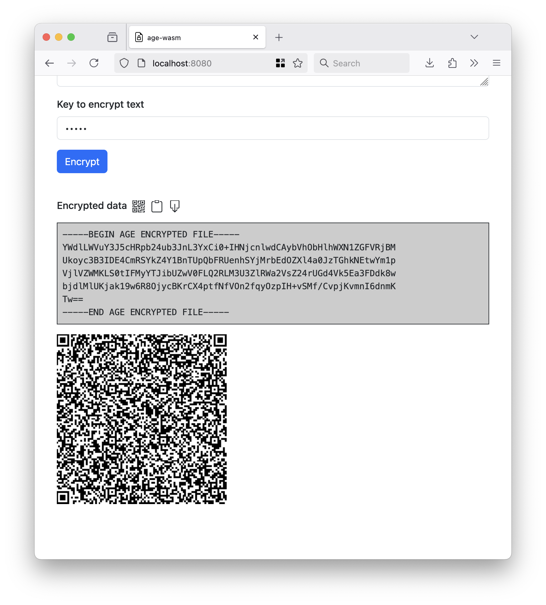
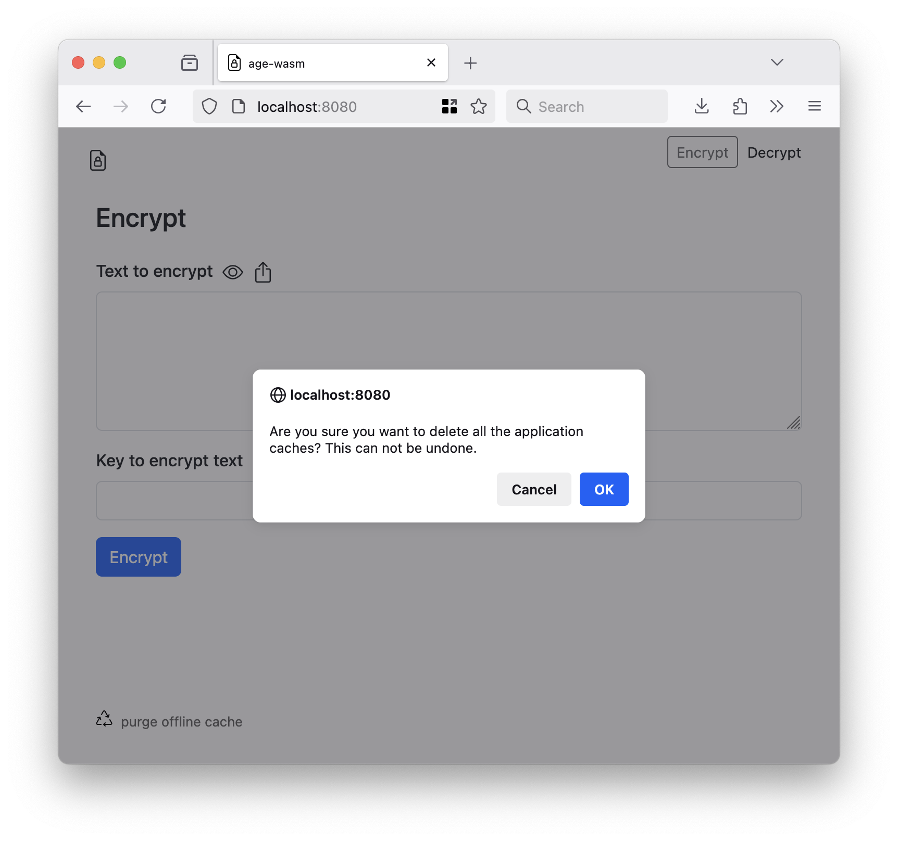

# wasm-age

Experimental package to export the [filippo.io/age](https://github.com/FiloSottile/age) scrypt encrypt and decrypt functions as a WebAssembly (WASM) binary with optional offline support.

## Experimental

Did I mention that was experimental? As in it _seems_ to work but I haven't finished thinking about it. There may be bugs. It may be a terrible idea.

## Limitations

* Currently this application only supports encrypting and decrypting strings using `age`'s "scrypt" identity (passwords) primitive.
* It also assumes plain-text values. Specifically all uses of the `File` web APIs to read or write local files assume plain-text data.

## Building

There is a pre-built `age.wasm` binary in the [www/wasm](www/wasm) folder but if you need or want to rebuilt it the easiest thing is to use the handy `wasmjs` Makefile target:

```
$> make wasmjs
GOOS=js GOARCH=wasm \
		go build -mod vendor -ldflags="-s -w" -tags wasmjs \
		-o www/wasm/age.wasm \
		cmd/wasm/main.go
```		

## Example

Point a web server at the [www](www) folder and then load it in your web browser. I like to use the `fileserver` tool in the [aaronland/go-http-fileserver](https://github.com/aaronland/go-http-fileserver) package mostly because I wrote but it, really, any web server will do. For example:

```
$> fileserver -root www
2025/06/04 10:36:23 Serving www and listening for requests on http://localhost:8080
```

And then when you open your web browser to `http://localhost:8080` you see something like this:


The default tab allows you to encrypt arbitrary text data. By default the text entered in to the form is hidden:


If you click on the  icon you can see the text you've entered.


Click the  icon to hide the text again. It is also possible to upload the text to encrypt from a (plain-text) file on the device by click the  icon.

Add a password (key) to encrypt the content. When you click the `Encrypt` button your text will be encrypted using `age` WebAssembly binary and the result will be printed to the screen.


If you click the  icon the encrypted content will be encoded in a QR code.



If your web browser supports the [Clipboard API](https://developer.mozilla.org/en-US/docs/Web/API/Clipboard) there will also be a  icon which will allow you to copy the encrypted data to your computer's clipboard. You can also download the encrypted text to a file on the local device by clicking the  icon.

Clicking the "Decrypt" button (at the top of the page) will display the new tab for decypted `age`-encoded data.


You can enter text manually, by scanning for data encoded in a QR code by clicking the  icon or by uploading the data to decode from a file on the device by clicking the  icon.

If you click the  icon a new dialog window will be open showing you what your camera's video feed as well as any QR codes that are located in the stream. Once the camera finds a QR code it will outline it in the image and write its data back to the default input form.


When you click the `Decrypt` button the data will be decrypted using the `age` WebAssembly binary and the results will be printed to the screen.


By default the unencypted data is obscured but if you click the  icon you can see the unencypted text. Click the  icon to hide the text again.

If your web browser supports the [Clipboard API](https://developer.mozilla.org/en-US/docs/Web/API/Clipboard) there will also be a  icon which will allow you to copy the unencrypted data to your computer's clipboard. You can also download the decrypted text to a file on the local device by clicking the  icon.

## Offline support

If the `<body>` element in the main `index.html` contains an "offline" attribute then support for registering the tool as an offline application will be initialized. For example:

```
    <body offline="true">
```

The default scope for the offline application is the pathname that the application is hosted from. For example:

```
    if (document.body.getAttribute("offline")){

	const scope = location.pathname;
	
	offline.application.init(scope).then((rsp) => {
	    console.debug("Offline application initialized.");
	}).catch((err) => {
	    console.error("Failed to initialize offline application", err);
	    alert("Failed to initialize offline application");
	});
    }
```

Support for running as an offline application is enabled by default and _should_ "just work" but [ServiceWorkers](https://developer.mozilla.org/en-US/docs/Web/API/Service_Worker_API/Using_Service_Workers) and offline-anything in browsers can be fussy and brittle so if you tell me it doesn't work for you I won't be overly surprised.

The simplest way to disable offline support is to remove the "offline" attribute from the `body` element in the [www/index.html](www/index.html) file.



If you need to purge the (offline) application cache click the "purge offline cache" link next to the  icon at the bottom of the page.

## Mobile

The application is responsive and adjusts to mobile devices.

## See also

* https://github.com/FiloSottile/age
* https://github.com/sfomuseum/js-sfomuseum-golang-wasm
* https://github.com/davidshimjs/qrcodejs
* https://github.com/cozmo/jsQR
* https://github.com/aaronland/js-offline-application